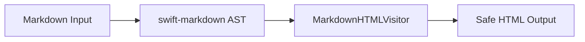

# PeekMD Compatibility Test Document

This document verifies full Markdown, GitHub-Flavored Markdown (GFM), safe HTML, Obsidian extensions, and PeekMD styling.

---

## 1. Headings & Typography

# Heading 1 (ATX)
## Heading 2 (ATX)
### Heading 3 (ATX)
#### Heading 4 (ATX)
##### Heading 5 (ATX)
###### Heading 6 (ATX)

Heading 1 (Setext)
==================

Heading 2 (Setext)
------------------

Paragraphs with **bold text**, *italic text*, ***bold-italic text***, ~~strikethrough~~, ==highlighted text==, `inline code`, `inline code with ``backticks```, superscript x^2^, subscript H~2~O, and a soft line break.
Here is a line with two spaces at the end for  
a hard line break.

---

## 2. Lists & Task Lists

### Nested Unordered Lists
* Level 1 Item A
  * Level 2 Item A.1
    * Level 3 Item A.1.i
  * Level 2 Item A.2
* Level 1 Item B

### Nested Ordered Lists
1. Step 1: Initialize
   1. Substep 1.a: Check environment
   2. Substep 1.b: Load config
2. Step 2: Execute

### Multiline List Items with Code Continuation
1. First paragraph in item 1.

   Second paragraph in the same item 1.

   ```swift
   let x = 42
   print(x)
   ```

2. Second list item.

### Task Lists with Nesting
- [x] Completed root task
  - [x] Completed subtask
  - [ ] Pending subtask
- [ ] Incomplete root task

---

## 3. Tables & Edge Cases

| Syntax | Description | Escaped Pipe | Number Align |
| :--- | :---: | :--- | ---: |
| Normal | Plain text | `A \| B` in code | 100.50 |
| Advanced | More content with **bold** | Value \| with pipe | 2,450.00 |

---

## 4. Blockquotes & Callouts

> Standard blockquote with nested content:
> > Nested blockquote level 2.

> [!NOTE] Custom Note Title
> This is a standard informative note callout.

> [!TIP]
> This is a helpful tip callout.

> [!IMPORTANT]
> This is an important notice callout.

> [!WARNING]
> This is a warning callout.

> [!CAUTION]
> This is a critical caution callout.

> [!SUCCESS]
> Action completed successfully!

> [!QUESTION]
> Did you know PeekMD supports Obsidian callouts?

> [!DANGER]
> Dangerous action ahead!

> [!BUG]
> Known issue being tracked.

> [!EXAMPLE]
> Here is a practical example.

> [!QUOTE]
> Simplicity is prerequisite for reliability.

> [!NOTE]+ Foldable Expanded Note
> This callout starts expanded and can be toggled.

> [!WARNING]- Foldable Collapsed Warning
> This callout starts collapsed.

---

## 5. Syntax Highlighting Tokenizer Safety

```swift
// Swift comment with URL https://swift.org and "quotes"
import Foundation

struct User: Sendable {
    let id: Int
    var name: String = "Alice class=\"token-string\"> test"
    var score: Double = 98.5
}
```

```typescript
// TypeScript strings and comments
interface Config {
    apiKey: string;
    retries: number;
}
const config: Config = {
    apiKey: "sk-test-1234 class=\"token-string\">",
    retries: 3
};
```

```json
{
  "name": "PeekMD",
  "version": "1.0.0",
  "active": true,
  "count": 42,
  "description": "Safe JSON string with class=\"token-property\">"
}
```

```bash
#!/usr/bin/env bash
# Bash comment with https://github.com
echo "Running build..."
curl -s https://api.example.com?query=class%3Dtoken
```

```html
<!-- HTML Source Code -->
<div class="test-container" id="app">
    <p align="center">Welcome to PeekMD!</p>
</div>
```

---

## 6. Safe GitHub README HTML Compatibility

<!-- Hidden HTML Comment: This should not be visible -->

<div align="center">
    <h1>Project Header in Div</h1>
    <p align="center">Centered subtitle using raw HTML paragraph</p>
    
</div>

<details>
    <summary>Click to view system requirements</summary>
    <p>macOS 13.0 or later (Ventura, Sonoma, Sequoia).</p>
    <ul>
        <li>Apple Silicon or Intel processor</li>
        <li>Quick Look support</li>
    </ul>
</details>

Safe inline HTML elements: <kbd>Cmd</kbd> + <kbd>Space</kbd>, <mark>marked text</mark>, <sub>subscript</sub>, and <sup>superscript</sup>.

Malicious HTML (Must be stripped/sanitized safely):
<script>alert('malicious script executed')</script>


---

## 7. Math / LaTeX Typesetting

Inline math: When $E = mc^2$, energy and mass are equivalent. Or with LaTeX delimiters: \( f(x) = x^2 \).

Display math with $$:
$$
\int_{-\infty}^{\infty} e^{-x^2}\,dx = \sqrt{\pi}
$$

Display math with \[ ... \]:
\[ \text{Deterministic harmonisation} \rightarrow \text{Material prior} \rightarrow \text{Real-EPD calibration} \]

---

## 8. Local Relative Images & Wikilinks

Markdown local relative image:


Wikilink standard: [[README]] and with alias: [[README|Project Readme]].
Wikilink section: [[README#Installation]] and block: [[README#^block-123]].
Wikilink embed: ![[assets/local-image-test.png|200]]

---

## 9. Mermaid Diagrams



---

## 10. Footnotes

Here is a statement with a footnote reference.[^1] And another reference.[^note]

[^1]: This is the first footnote definition.
[^note]: This is a named footnote explaining additional details.
