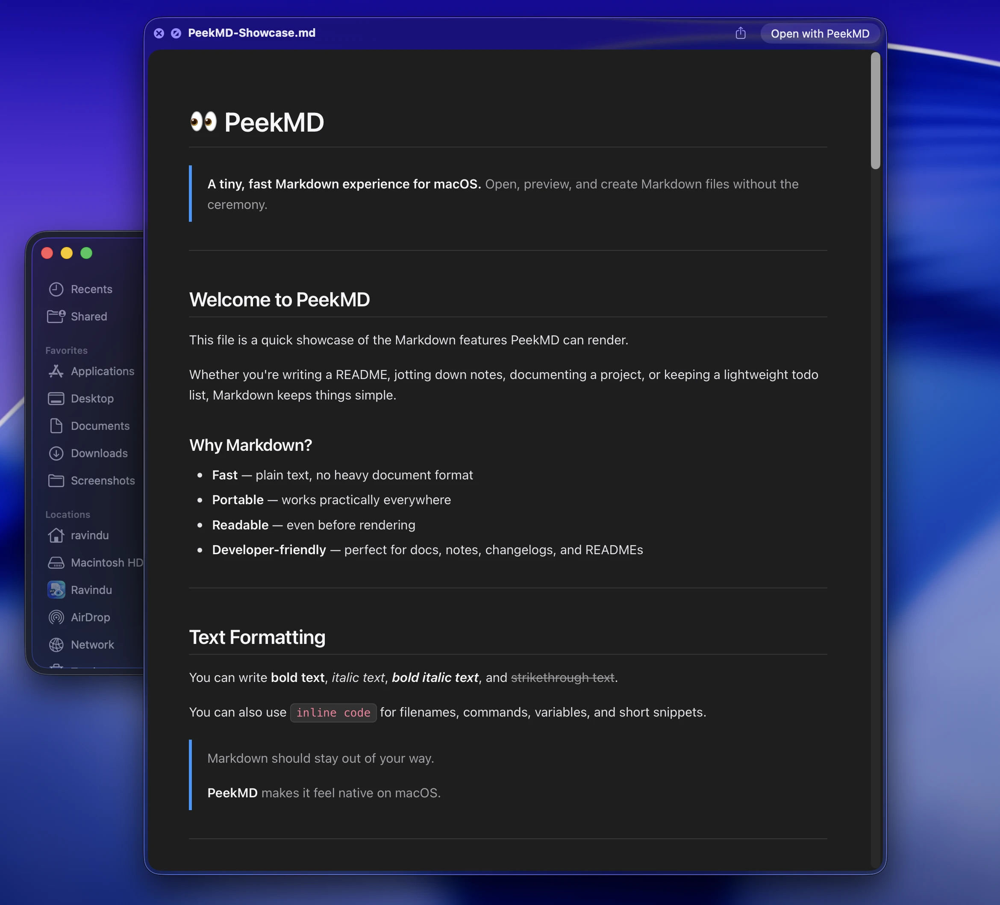
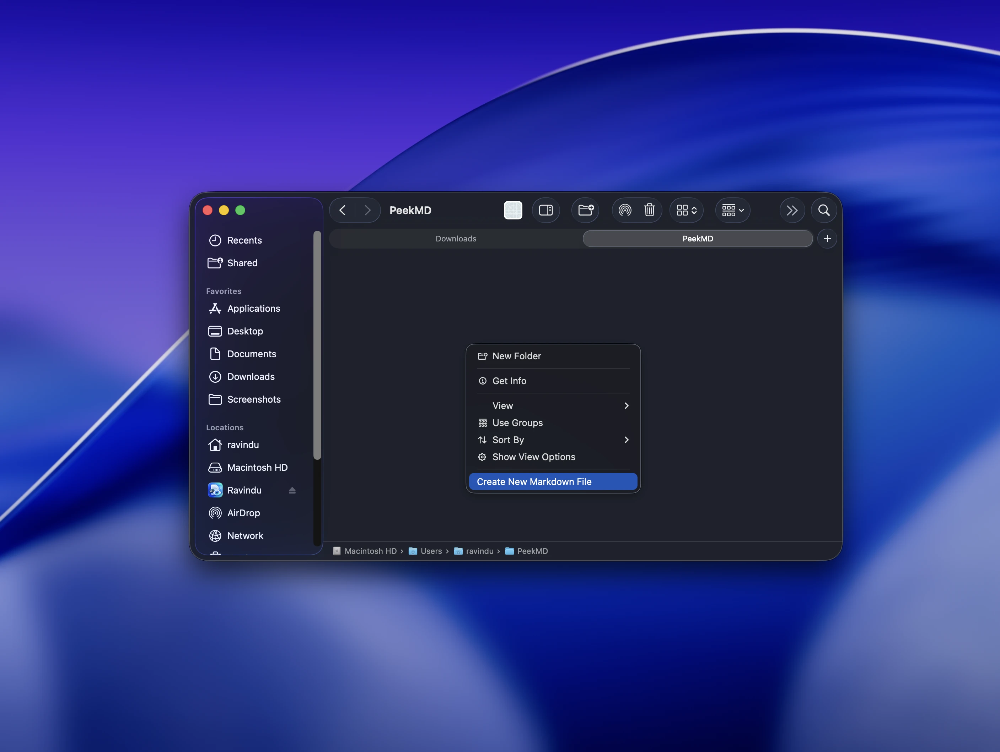
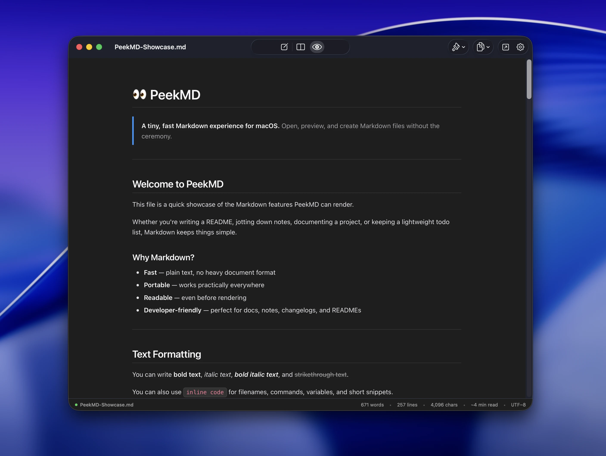
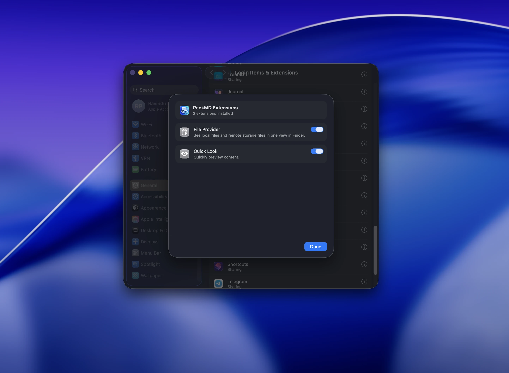

<div align="center">


# PeekMD

### Markdown where it belongs — right in Finder.

**Create Markdown files from Finder, preview them with Spacebar, and read them beautifully without a vault, workspace, or heavyweight editor.**

<br>

[](#requirements)
[](#development)
[](LICENSE)

</div>

<p align="center">
  
</p>

## Why PeekMD?

macOS has great file management and a great Quick Look experience, but Markdown still feels strangely second-class.

PeekMD fixes that with a small native utility:

- **Create**: Right-click the empty background of a Finder window and choose **Create New Markdown File**.
- **Preview**: Select any Markdown file and press **Space** for a rendered Quick Look preview.
- **Open**: Open Markdown files in PeekMD when you want a clean standalone reader.

No vaults. No imports. No project setup. Your normal files and folders remain the source of truth.

---

## Finder-native file creation

<p align="center">
  
</p>

PeekMD adds **Create New Markdown File** directly to Finder's blank-background context menu.

New files are created in the folder you're currently viewing, with collision-safe naming so existing files are never overwritten:

```text
Untitled.md
Untitled 2.md
Untitled 3.md
...
```

The newly created file is automatically selected in Finder, and PeekMD can optionally open it in your preferred editor.

---

## Quick Look that actually understands Markdown

Press **Space** on an `.md` or `.markdown` file and PeekMD renders it directly inside macOS Quick Look.

Current renderer support includes:

- Headings, paragraphs, emphasis, and strikethrough
- Ordered and unordered lists
- Task lists (`- [ ]`, `- [x]`)
- Blockquotes
- Inline and fenced code blocks with language badges & syntax highlighting
- GFM tables with alignment support
- Links
- Local relative images (`images/diagram.png`)
- YAML frontmatter presentation
- Obsidian-style callouts (`[!NOTE]`, `[!TIP]`, `[!WARNING]`, `[!IMPORTANT]`, `[!CAUTION]`)
- LaTeX / math expressions (`$...$`, `$$...$$`)
- Automatic light and dark appearance
- Multiple rendering themes (System, GitHub, Minimal, Academic)

PeekMD uses the same shared Markdown rendering package for Quick Look and the standalone app, keeping output consistent across both experiences.

---

## Standalone reader & viewer

<p align="center">
  
</p>

When you want a dedicated reading experience, open any Markdown file directly in PeekMD:

- Clean, distraction-free reading mode with customizable typography and themes
- Live document statistics (word count, line count, character count, reading time)
- Side-by-side live split editor and previewer
- One-click "Open in External Editor" for quick handoffs to your preferred editor

---

## Native macOS integration

<p align="center">
  
</p>

PeekMD is built as a native macOS application with dedicated Finder and Quick Look extensions.

After installing, open PeekMD once and make sure its extensions are enabled in:

**System Settings → General → Login Items & Extensions**

---

## Features

| Feature | Status |
|---|:---:|
| Finder blank-background **Create New Markdown File** | ✅ |
| Collision-safe filenames | ✅ |
| Automatically select created file in Finder | ✅ |
| Optional open-after-create | ✅ |
| Preferred external editor integration | ✅ |
| Quick Look Markdown rendering (Spacebar) | ✅ |
| `.md` / `.markdown` support | ✅ |
| Local relative images | ✅ |
| GFM tables & task lists | ✅ |
| Syntax-highlighted code blocks | ✅ |
| Obsidian-style callouts | ✅ |
| LaTeX / math expressions | ✅ |
| Light / dark adaptive appearance | ✅ |
| Standalone Markdown viewer & split editor | ✅ |
| Native Swift / SwiftUI macOS app | ✅ |

---

## Requirements

- macOS 13 Ventura or newer
- Apple Silicon or Intel Mac supported by macOS 13+
- Xcode with Swift 5.9+ if building from source

---

## Build from source

Clone the repository:

```bash
git clone https://github.com/ravindusp/PeekMD.git
cd PeekMD
```

### Xcode

Open the Xcode project:

```bash
open MarkdownFinder.xcodeproj
```

Select your development team under **Signing & Capabilities** for the app and extension targets, then build with `⌘B` or run with `⌘R`.

### Scripts

The repository also includes helper scripts:

```bash
# Run the Swift test suite
./Scripts/test.sh

# Build the complete app bundle with extensions
./Scripts/build.sh

# Install to ~/Applications and register the extensions
./Scripts/install_and_register.sh

# Package release DMG installer
./Scripts/package_dmg.sh
```

---

## Architecture

```text
PeekMD.app
│
├── Main macOS App
│   ├── SwiftUI interface
│   ├── Settings & onboarding
│   ├── Location management
│   └── Standalone Markdown viewer/editor
│
├── Finder Sync Extension
│   ├── Finder context-menu integration
│   ├── Current-folder detection
│   ├── Markdown file creation
│   └── Finder selection / open-after-create
│
├── Quick Look Preview Extension
│   ├── QLPreviewProvider
│   ├── .md / .markdown support
│   └── Rendered HTML previews
│
├── Shared
│   ├── Preferences
│   ├── File creation
│   ├── Filename resolution
│   └── Location management
│
└── MarkdownRenderer
    ├── Markdown parser
    ├── HTML generator
    ├── Themes
    ├── Callouts
    ├── Math
    └── Local image resolution
```

The Finder extension is intentionally kept lightweight. Markdown parsing and rendering lives in the shared `MarkdownRenderer` package instead of being duplicated inside Finder-specific code.

---

## Project structure

```text
PeekMD/
├── MarkdownFinder.xcodeproj
├── MarkdownFinderApp/
├── MarkdownFinderExtension/
├── MarkdownQuickLookExtension/
├── Packages/
│   └── MarkdownRenderer/
├── Shared/
├── Tests/
├── Scripts/
├── Assets/
│   ├── Screenshots/
│   │   ├── quick-look-preview.webp
│   │   ├── finder-context-menu.webp
│   │   ├── standalone-viewer.webp
│   │   └── extensions.webp
│   └── AppIcon_1024.png
├── Package.swift
└── project.yml
```

The project is generated/configured with XcodeGen via `project.yml`, while `Package.swift` exposes the shared renderer/core code and test targets.

---

## Development

Run the tests:

```bash
swift test
```

or:

```bash
./Scripts/test.sh
```

PeekMD targets:

- **Swift 5.9**
- **macOS 13.0+**
- **SwiftUI + AppKit**
- **FinderSync**
- **Quick Look**
- **Swift Package Manager**

---

## Philosophy

PeekMD is not trying to become a bloated Markdown workspace.

It is a macOS quality-of-life tool built around a few simple ideas:

- Files should stay normal files.
- Folders should stay normal folders.
- Reading Markdown should be instant.
- Creating a Markdown file should be as easy as creating a folder.
- A Markdown viewer should not require a vault, database, import step, or indexing process.

---

## License

Licensed under the [Apache License 2.0](LICENSE).

Copyright © 2026 Ravindu Palihakkara.
